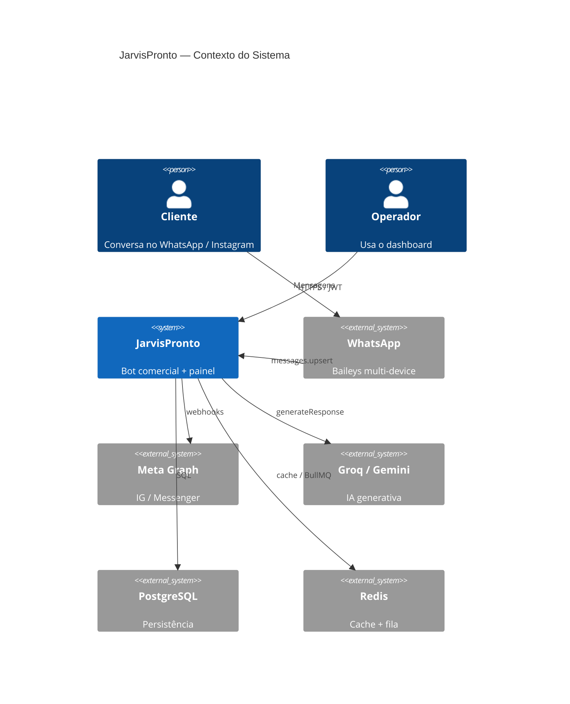
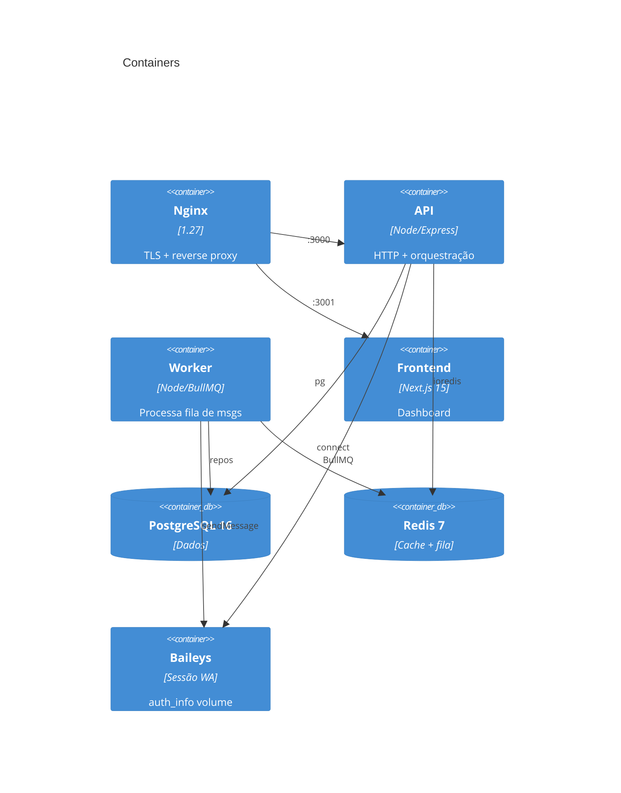

# Arquitetura JarvisPronto v1.5

## Diagrama C4 — Contexto

## Containers

## Fluxo de mensagem (com fila)

1. Cliente envia texto no WhatsApp  
2. Baileys `messages.upsert` → `whatsappService`  
3. Se `USE_MESSAGE_QUEUE=1` → `enqueueIncoming` (BullMQ)  
4. Worker consome job → `messageController` → repositórios → IA → `sock.sendMessage`  
5. Dashboard consulta `/api/conversations` com JWT  

## SimulationEngine

Quatro níveis de agentes em `engine/simulation/agents/`:

| Nível | Arquivo | Comportamento |
|-------|---------|---------------|
| 1 | AgentLevel1 | Respostas mínimas / quase reativas |
| 2 | AgentLevel2 | Contexto curto, pouco persuasivo |
| 3 | AgentLevel3 | Funil consciente, trata objeção |
| 4 | AgentLevel4 | Fechamento agressivo e contextual |

Usado via `/api/simulation` (JWT) para QA de prompts sem consumir sessão real.

## Segurança (v1.5)

- CORS allowlist estrita (`CORS_ORIGINS`)
- `/api/channels/status` exige JWT; webhooks Meta públicos
- Refresh token com `family_id` + detecção de reuso
- Portas 5432/6379 não expostas no host
- Senha default rejeitada no boot (produção)
- Rate limit + request-id + `/metrics`
